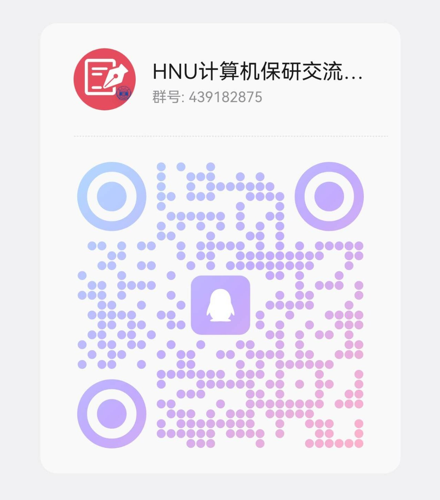

# 🎓 湖南大学计算机学科保研仓库

> 星光不负赶路人，时光不负有心人

本项目收集整理了湖南大学计算机相关专业的保研经验分享，旨在为学弟学妹们提供参考和指引。感谢所有无私分享经验的同学们！

HNU计算机保研交流群（进群提供学号信息+改备注）：439182875

## 📅 年度汇总

### 2026届
| 专业 | 排名 |      去向       |                          分享链接                          |
| :--: | :--: | :-------------: | :--------------------------------------------------------: |
| 计科 | rk1  | SJTU+中关村学院 | [📖 阅读](https://zhuanlan.zhihu.com/p/1951402364398461456) |
| 智能 | rk2  | RUC+中关村学院  | [📖 阅读](https://zhuanlan.zhihu.com/p/1951285345363693688) |

### 2025届
| 专业 | 排名 |   去向   |    分享链接     |
| :--: | :--: | :------: | :-------------: |
| 计科 | rk3  | 清华大学 | [📖 阅读](链接1) |

### 2024届
| 专业 | 排名 |       去向       |    分享链接     |
| :--: | :--: | :--------------: | :-------------: |
| 拔尖 | rk1  |   中科院计算所   | [📖 阅读](链接2) |
| 计科 | rk2  | 中国科学技术大学 | [📖 阅读](链接3) |

## 💡 投稿说明

欢迎各位同学分享自己的保研经验！直接提issue， 

如果没有github投稿经验，可以在红群联系负责同学（群主）投稿，请提供：

1. 基本信息（专业、rank、去向）
2. 经验分享内容（可多种形式：博客、知乎、PDF等）
3. 可选：联系方式（如邮箱、知乎主页等）

## 🤝 贡献者

感谢所有贡献宝贵经验的同学们：

## 📜 许可证

本项目采用 [CC BY-NC 4.0](https://creativecommons.org/licenses/by-nc/4.0/) 许可证，仅限非商业使用，使用时请注明出处。

---

⭐ 如果这个项目对您有帮助，请给我们一个star表示支持！

